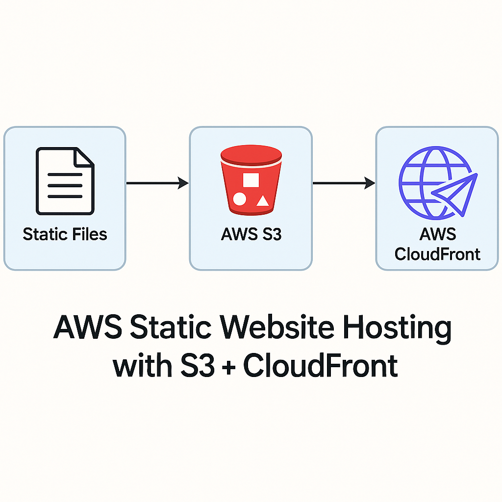
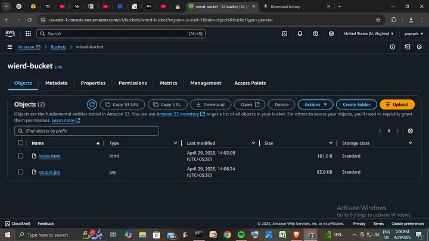
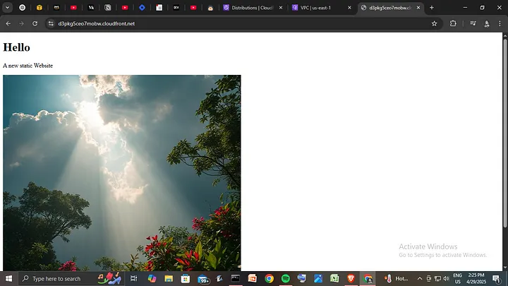

# AWS Static Website Hosting with S3 + CloudFront  
> Host a secure, scalable, and fast static website using AWS S3 and CloudFront

## Overview  
This project demonstrates how to host a static frontend website using **Amazon S3** for storage and **CloudFront** as the global content delivery network (CDN). The website includes HTTPS support, versioned deployments, and optional custom domain configuration.

---

## Tech Stack  
- **AWS S3** – Object storage to host static website files  
- **AWS CloudFront** – CDN to cache and serve content globally with HTTPS  
- **AWS Route 53** *(optional)* – For custom domain + SSL  
- **Terraform** *(optional)* – For infrastructure automation  
- **GitHub** – Version control

---

## Architecture Diagram



---

## Project Structure

```

project-root/
├── site/ # Your static files (HTML, CSS, JS)
├── terraform/ # Terraform files (optional IaC)
├── screenshots/ # Demo screenshots
├── .gitignore
└── README.md

````

---

## Setup Instructions

### Option 1: Manual Deployment (AWS Console)

1. **Create S3 Bucket**  
   - Name: `your-site-name`  
   - Uncheck “Block All Public Access”  
   - Enable Static Website Hosting  
   - Note the endpoint URL

2. **Upload Files**  
   - Go to “Objects” → “Upload” your `index.html`, CSS, JS files

3. **Set Bucket Policy**
   ```json
   {
     "Version": "2012-10-17",
     "Statement": [
       {
         "Sid": "PublicReadGetObject",
         "Effect": "Allow",
         "Principal": "*",
         "Action": "s3:GetObject",
         "Resource": "arn:aws:s3:::your-site-name/*"
       }
     ]
   }


4. **Create CloudFront Distribution**

   * Origin Domain: S3 static site endpoint (e.g., `your-site-name.s3-website-us-east-1.amazonaws.com`)
   * Set default root object: `index.html`
   * Optional: Add custom domain + SSL (from ACM)

---

### Option 2: Deploy Using Terraform (Optional)

> Automate everything using Infrastructure as Code

```bash
cd terraform/
terraform init
terraform apply
```

---

## Custom Domain with HTTPS (Optional)

1. Buy/manage domain in Route 53
2. Issue SSL Certificate via ACM (in `us-east-1`)
3. Link domain + SSL to CloudFront
4. Add DNS A/AAAA records in Route 53

---

## Screenshots




---

## Useful AWS CLI Commands

```bash
# Upload static site files to S3
aws s3 sync ./site s3://your-bucket-name --acl public-read

# Invalidate CloudFront cache
aws cloudfront create-invalidation \
  --distribution-id YOUR_DISTRIBUTION_ID \
  --paths "/*"
```

---

## Live Demo

[View Live Site](https://your-cloudfront-id.cloudfront.net)
*(Replace with your actual distribution URL or custom domain)*

---

## Author

**Your Name**

* GitHub: [@yourusername](https://github.com/yourusername)
* LinkedIn: [linkedin.com/in/yourusername](https://linkedin.com/in/yourusername)
* Portfolio: [yourusername.github.io](https://yourusername.github.io)

---

## License

MIT – free to use and modify

```

---

Let me know if you want:
- A **matching architecture diagram**
- Terraform templates for S3 + CloudFront
- A **clean starter repo** to clone

I can generate those too.
```
